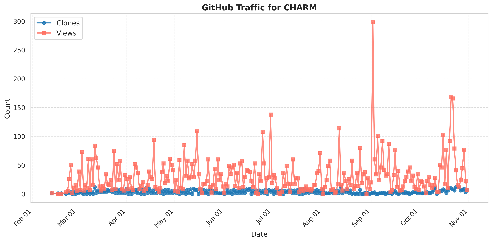

# Team
Principal Investigator: Prof. Peipei Zhou, https://peipeizhou-eecs.github.io/

Ph.D. Students: Jinming Zhuang (Student Lead), Zhuoping Yang, Shixin Ji

Faculty Collaborators: Professors Jingtong Hu (Pitt), Alex Jones (Syracuse), Deming Chen (UIUC), Yiyu Shi (Notre Dame), Yanzhi Wang (Northeastern) and Jason Cong (UCLA)

Student Collaborators: Jason Lau (UCLA) and Hanchen Ye (UIUC)

AMD Collaborators: Stephen Neuendorffer, Jack Lo, and Kristof Denolf

[](https://zenodo.org/badge/latestdoi/558491173)

## 🚀 Thank You for Using CHARM! ! !
### Your support and growing engagement inspire us to continually improve and enhance the project.
+ Total Views since 02/13/2025: <!--VIEWS-->8786<!--/VIEWS-->
+ Total Downloads since 02/13/2025: <!--CLONES-->1008<!--/CLONES-->



# CHARM: Composing Heterogeneous AcceleRators for Matrix Multiply on Versal ACAP Architecture (FPGA'23)
# High Performance, Low Power Matrix Multiply Design on ACAP: from Architecture, Design Challenges and DSE Perspectives (DAC'23). 
# SSR: Spatial Sequential Hybrid Architecture for Latency Throughput Tradeoff in Transformer Acceleration (FPGA'24) 
# CHARM 2.0: Composing Heterogeneous Accelerators for Deep Learning on Versal ACAP Architecture (ACM TRETS'24) 

# ESWEEK 2023 and DAC 2023 Video Demos: https://drive.google.com/file/d/1wWn7R_l-Sfbg818Hmvg2448l9WvGy-YK/view?usp=sharing

## ACM/IEEE Reference Format
1. Jinming Zhuang, Jason Lau, Hanchen Ye, Zhuoping Yang, Yubo Du, Jack Lo, Kristof Denolf, Stephen Neuendorffer, Alex Jones, Jingtong Hu, Deming
Chen, Jason Cong, Peipei Zhou. 2023. CHARM: Composing Heterogeneous Accelerators for Matrix Multiply on Versal ACAP Architecture. In Proceedings of the 2023 ACM/SIGDA International Symposium on Field Programmable Gate Arrays (FPGA ’23), February 12–14, 2023, Monterey, CA, USA. ACM, New York, NY, USA, 12 pages.

ACM PDF: https://doi.org/10.1145/3543622.3573210
Author Version PDF: https://peipeizhou-eecs.github.io/publication/fpga23/

2. Jinming Zhuang, Zhuoping Yang, Peipei Zhou. 2023. High Performance, Low Power Matrix Multiply Design on ACAP: from Architecture, Design Challenges and DSE Perspectives. In Proceedings of the 60th ACM/IEEE Design Automation Conference, San Francisco, California, USA, (DAC ’23), July 9–13, 2023, San Francisco, CA, USA. https://doi.org/10.1109/DAC56929.2023.10247981

IEEE PDF: https://ieeexplore.ieee.org/document/10247981
Author Version PDF: https://arxiv.org/pdf/2305.18698.pdf

3. Jinming Zhuang, Zhuoping Yang, Shixin Ji, Heng Huang, Alex K. Jones, Jingtong Hu, Yiyu Shi, Peipei Zhou. 2024. SSR: Spatial Sequential Hybrid Architecture for Latency Throughput Tradeoff in Transformer Acceleration (FPGA'24) 

ACM PDF: https://doi.org/10.1145/3626202.3637569

4. Jinming Zhuang, Jason Lau, Hanchen Ye, Zhuoping Yang, Shixin Ji, Jack Lo, Kristof Denolf, Stephen Neuendorffer, Alex Jones, Jingtong Hu, Yiyu Shi, Deming
Chen, Jason Cong, Peipei Zhou. CHARM 2.0: Composing Heterogeneous Accelerators for Deep Learning on Versal ACAP Architecture (ACM TRETS'24)

ACM PDF: https://dl.acm.org/doi/10.1145/3686163

5. Dong, Peiyan, Jinming Zhuang, Zhuoping Yang, Shixin Ji, Yanyu Li, Dongkuan Xu, Heng Huang et al. "EQ-ViT: Algorithm-Hardware Co-Design for End-to-End Acceleration of Real-Time Vision Transformer Inference on Versal ACAP Architecture." IEEE Transactions on Computer-Aided Design of Integrated Circuits and Systems 43, no. 11 (2024): 3949-3960.

IEEE PDF: https://doi.org/10.1109/TCAD.2024.3443692
Author Version PDF: https://peipeizhou-eecs.github.io/publication/2024_esweek_eqvit/2024_esweek_eqvit.pdf

# **New Release  ! &emsp;  !  &emsp; !** 2023.05.29
## **PyACAP 1.0: Python Based Automatic Code Generation for Versal ACAP**:<br> 
+ **What's new ?:** In this release we create an entire python interface for matrix multiply under floating-point 32 data type for Versal ACAP VCK190 and VCK5000 Platforms.
+ **Overall Compilation Flow**:<br><br>
<br><br>
+ **Python Interface Introduction**:<br>
**Quick Start: Running project_setup.py**
```bash
python project_setup.py
```
```Python
from charm import* 

#Define the left-hand-side(A) and right-hide-side(B) operands
A=np.random.rand(4096, 4096).astype(np.float32)
B=np.random.rand(4096, 4096).astype(np.float32)

#Create the object of the class charm
automm=charm(prj_dir)

#Launch charm dse to find optimized hardware configuration
Versal_config=automm.cdse(A,B)

#Launch charm automatic code generator to emit the code for AIE, PL and Host CPU
device='vck190' # Supported devices are vck190 and vck5000
automm.cacg(Versal_config,device)

#Run Vitis Compilation Flow
automm.build()
```

## Overview
In this repo, we use general-purpose Matrix-Matrix Multiplication (GEMM) applications as an example and provide a detailed description of how to build a system-level design on AMD Versal VCK190 Platform. By going through this repo, users can get knowledge on:

+ How to design a highly efficient single AIE kernel by leveraging the 7-way very long instruction words (VLIW)?
+ How to sustain 400 AIEs with the limited I/O interfaces between AIE and PL by using a broadcast-packet mechanism?
+ How to transfer data from PL/AIE to AIE/PL by using a bubble-free pipeline strategy?

We provide an automatic code generation and compilation flow that users can build the system on Versal step by step by changing the configuration files.

## Dependencies 
To play with the Charming Accelerators, the following software and hardware dependencies are required:
+ Linux System with "tar" installed
+ **AMD/Xilinx Vitis 2021.1** (Version 2021.1 guarantees the designs in the example folder to be compiled correctly)
+ AMD/Xilinx XRT Library
+ AMD/Xilinx Versal VCK190 (Vitis 2021.1)
+ AMD/Xilinx Versal VCK5000 (`xilinx_vck5000_gen3x16_xdma_1_202120_1`, Vitis 2021.2)
+ AMD/Xilinx Versal VCK5000 (`xilinx_vck5000_gen4x8_qdma_2_202220_1`, Vitis 2022.2-2023.1)

## Environment Setup <br/>

### 1. To quickly boost and run experiments on the board instead of building the platform and Linux from scratch, users can download the platform package (VCK190 Base 2021.1) and petalinux common image(Versal common image) from the following link:<br/>
https://www.xilinx.com/support/download/index.html/content/xilinx/en/downloadNav/embedded-platforms/2021-1.html

### 2. Install the platform and Petalinux
```bash
unzip xilinx_vck190_base_202110_1.zip
```
```bash
tar -xf xilinx-versal-common-v2021.1.tar.gz
cd xilinx-versal-common-v2021.1
sh sdk.sh
```

### 3. VCK190 Base 2021.1: It contains the pre-built Versal extensible embedded platform. During compilation users need to specify the platofrm path in the following format.<br/> 
```bash
PLATFORM=${PATH}/xilinx_vck190_base_202110_1/xilinx_vck190_base_202110_1.xpfm
```

### 4. Versal common image: It includes the petalinux system boot files and the cross compilation environment needed for ARM CPU. During compilation, users need to point the path to SYSROOT and EDGE_COMMON_SW.<br/>
```bash
SYSROOT = ${PATH}/sysroots/cortexa72-cortexa53-xilinx-linux
EDGE_COMMON_SW=${PATH}/xilinx-versal-common-v2021.1
```

### 5. Vitis and Cross-compilation Environment Setup<br/>
```bash
source /opt/tools/xilinx/Vitis/2021.1/settings64.sh
source /opt/xilinx/xrt/setup.sh
unset LD_LIBRARY_PATH (If needed)
source ${PATH}/environment-setup-cortexa72-cortexa53-xilinx-linux
```

### 6. Project Setup and Compilation
Users can generate the customized project by setting up the configuration file and directly running the following command:
```bash
./project_setup.sh ./config_files/input.cfg ${Project_DIR}
cd ${Project_DIR}
make all PLATFORM=${PATH} EDGE_COMMON_SW_PATH=${PATH} SYSROOT_PATH={PATH}
```
### 7. On Board Execution for MM with Arbitrary Sizes
After copy the sd card image to micro sd card and boot up the system run the following commands to get the execution results. {M}, {K}, {N} refers to the size of MM. In order to reduce the effect of overhead of calling API when runnning the kernel, users can specify the number of {iteration} of running the MM then it provides the average throughput. To verify the correctness of the MM kernel, {verify} should be assigned to 1, otherwise 0. One example of running MM with 1024\*1024\*1024 for 100 iterations without verify the result can be: **./hostexe mm_hw.xclbin 1024 1024 1024 100 0**
```bash
cd /mnt/sd-mmcblk0p1
./hostexe mm_hw.xclbin {M} {K} {N} {iteration} {verify}
```

### Targeting VCK5000

By default, CHARM targets the `xilinx_vck5000_gen3x16_xdma_1_202120_1` platform
for VCK5000.
To target the `xilinx_vck5000_gen4x8_qdma_2_202220_1` platform,
we require Vitis 2022.2-2023.1 and the `PLATFORM_NAME` variable to be defined for
the build process, i.e.:

```bash
make all PLATFORM_NAME=xilinx_vck5000_gen4x8_qdma_2_202220_1
```

Note: with higher total off-chip bandwidth and AIE clock frequency, the VCK5000
can show better QoR than the VCK190, e.g. for single square MM kernels:

| Size | Paper (GFlop/s) | Observed (GFlop/s) |
|:----:|:---------------:|:------------------:|
| 1024 |         1103.46 |            1598.24 |
| 4096 |         2718.42 |            4081.14 |
| 6144 |         3277.99 |            4518.02 |

## Step-by-Step Tutorial
In this part, we first introduce the overall MM tiling strategy including four levels of tilings. Then in the later parts, we illustrate the methodology of how we handle each of these level of tilings.<br>
### Overall MM Tiling Strategy:<br>
Given a large Matrix Multiplication(MM) with size (M\*K) * (K\*N) refer as M\*K\*N, the listing below shows four level of tilings to handle this MM (from innermost to outermost):<br>
+ Line 16-20: MM calculated on a **single AIE core**. 
+ Line 12-14: The spatial distribution unrolled across different AIE cores in **AIE Array**.
+ Line 7-9: The sequential processing of data stored in **PL on-chip memories**. 
+ Line 2-4: The temporal processing of data stored in off-chip memory.<br>

We visualize the on-chip buffer level tiling in the right figure. We refer the MM calculated in single AIE as  **"Tile"**  level and refer the MM unrolled on AIE array level as  **"Batch"**  level. The strtegy of mapping the tiled MM on AIE array will be illustrated later. 

 

### Single AIE Programming:<br>
In this part, we demonstrate the coding style of calculating MM with size **TI\*TK\*TJ** in a single AIE which corresponds to the **first level of tiling**.<br>

AIE is a very-long instruction word (VLIW) processor which can issue upto seven operations in parallel using one VLIW word:<br>
+ **Two Load** Operations: Load upto (the width of data could change) two 256bits data from AIE local memory to AIE register.<br>
+ **One Store** Operation: Store upto one 256bits data from AIE register to AIE local memory.<br>
+ **One Vector** Operation: Calculating a vector matrix multiply or add.<br>
+ **One Scalar** Operation<br>
+ **Two Move** Operations: Two move operations that move the data from scalar/vector to scalar/vector.<br> $~~~~~~~~~~~~~~~~~~~~~~~~~~~~~~~~~~~~~~~~~~~~~$

<br>

**The key challenge of programming single AIE is how to make back-to-back issued instructions by utilizing the 32KB local memory and 2KB local registers of a single AIE (for integer data type there are additional 3KB accumulator registers).**<br>

We provide our source code that achieves 95% efficiency when calculating 32\*32\*32 MM in src/aie/mm_kernel0.cc. The visualization of the algorithm is shown below:<br>

**The insights of programming AIE are:**
+ **Mannually unroll the innermost loop to make it fully pipelined**: View the report under "Work/aie/xx_xx/xx_xx.log" (here xx_xx is the position of AIE) after compilation and make sure 1) "Critical cycle of length" equals the number of vector operations. 2) The cycle after folding achieves the cycle due to"Critical cycle of length". The following figure is reported from a cycle-accurate simulator (Vitis Analyzer) provided by AMD. In our innermost loop (line 43), we manually unrolled 16 vector mac operations and after checking we fully pipelined them.<br>
<br>
+ **Avoid of using judgment statement in the innermost loop**: The judgment statement will prevent the compiler to achieve fully pipelined MAC instructions. As can be seen in line 98, since we need to store the data from the register back to the local memory when finishing the last iteration of the reduction dimension (K loop), to avoid using the judgment in the innermost loop we manually write the last iteration of the innermost loop out of the "for loop" region. <br>
+ **Using __restrict and chess_prepare_for_pipelining pragma to improve the efficiency**: [Software pipelining](https://www.xilinx.com/content/dam/xilinx/support/documents/sw_manuals/xilinx2022_1/ug1079-ai-engine-kernel-coding.pdf)**<br>

## Automatic Code Generation (ACG):<br>
The tools for automatically generating the source code are under ""src_gen"" folder

**ACG** takes platform information and user-specified design point as input and automatically generated the system-level design by launching the following 4 template based components sequentially:<br>

**Kerne_lGen:** Kernel_Gen is launched to generate both the single AI Engine(AIE) C code and adaptive data flow (ADF) graph code in C++ for verifying the correctness of a single kernel design. MM kernels with fp32 data type in different shapes that can be fit in a single kernel are supported in current version.<br>

**AIE_ArrGen:** AIE_ArrGen is launched to generate new ADF graph code that defines how packet-switch streams are connected to AIE array which contains 400 AIEs. Single kernel calculating 32x32x32 MM with fp32 data type is supported to scale out to the AIE array. <br>

**PL_Gen:** Based on the AIE array created by AIE_ArrGen, PL_Gen is launched to generate PL streams, scheduling controller C/C++ HLS modules to communicate with AIE array and PL on-chip buffers, off-chip AXI data transfer modules to communicate with DDR. Differnet system level designs varying in on-chip buffer size and its implementation option (BRAM or URAM) fp32 data type are supported.<br>

**Host_Gen:** Host_Gen is launched to generate the system control logic running on the ARM CPU by using AMD XRT APIs.<br>

**Compilation**
After code generation, the vendor tools AIE compiler and V++ compiler take ADF gragh and HLS C/C++ as input respectively. Their output object file libadf.a and kernel.xo will be linked into xclbin file which includes the hardware information of the design for the target platform. C++ compiler compiles XRT API-based host code to executable file runs on CPU.<br>

### Configuration File 
We provide a configuration file template under "./config_files/input.cfg", users can specify the platform, data type, kernel type, and mapping strategy of each level in this file. The feasible option of each parameter are illustrated in **( )** The rules of using this configuration file are listed below:
- **Platform** refers to the hardware platform used in the project. VCK5000 and VCK190 are supported in the current framework.
- **DATA_TYPE** the framework currently support fp32, int16 and int8 data types.
- **KernelGen, AIEArrGen, SysGen** decide if the corresponding ACG should be launched (1 refers to launch). 
- **KRL_TYPE** refers to two types of MM kernels provided in our source file.
- **I, K, J** refers to the MM size stored and calculated in a single AIE.
- **A, B, C** refers to the BATCH level parameter.
- **X, Y, Z** refers to the on-chip level parameter.
- **LHS_BUFF, RHS_BUFF, OUT_BUFF** decide the implementation option for LHS, RHS, and output buffers. 1 refers to URAM and 0 refers to BRAM. For example, LHS_BUFF=1 means the LHS buffer is implemented by URAM.
```sh
Platform:VCK190;
DATA_TYPE:fp32;
KernelGen:1;
	KRL_TYPE:0;
	I:32;
	K:32;
	J:32;
AIEArrGen:1;
	NUM_PACK:4;
	A:6;
	B:4;
	C:16;
	A_BRO:4;
	C_BRO:3;
SysGen:1;
	X:8;
	Y:1;
	Z:2;
	LHS_BUFF:0;
	RHS_BUFF:0;
	OUT_BUFF:1;
```

# Applications
We provide four applications under the example folder including BERT for natural language processing, NCF for recommendations, ViT for vision classification, MLP for multi-layer perceptron classification or regression. The expected throughput should be the same as the results shown in the following figure: <br> 

<br>

To quickly reproduce the results, we provide the pre-built object files of AIE, PL, and ARM CPU in the pre_built folder. Users can go to the corresponding folder and run the following command to create the sd card image for onboard execution.
```
make package EDGE_COMMON_SW_PATH=${PATH} SYSROOT_PATH={PATH}
```

# Errata Sheet
1) A typo appears in Table 6 of the paper. The latency for MLP should be "119ms" instead of "11.9ms". <br>
2) In Table 5, the size of the fifth layer of ViT should be 3072\*1024\*3072 instead of 3072\*1024\*3048.

# Acknowledgement
We acknowledge the support from the University of Pittsburgh New Faculty Start-up Grant, NSF awards #2213701, #2217003, and the support from CRISP, one of six SRC JUMP centers. We thank AMD/Xilinx for FPGA and software donation, and support from the AMD/Xilinx Center of Excellence
at UIUC, the AMD/Xilinx Heterogeneous Accelerated Compute Cluster at UCLA, and the Center for Research Computing (CRC) at the University of Pittsburgh.

**References:**<br>
[1] **[AIE Architecture(AM009 2021.1)](https://docs.xilinx.com/r/en-US/am009-versal-ai-engine)**<br>
[2] **[AIE Instructions and APIs(UG1078 UG1529)](https://www.xilinx.com/htmldocs/aiengine_intrinsics_start.html)**<br>
[3] **[AIE Coding Example(UG1079 2021.1)](https://docs.xilinx.com/r/2021.1-English/ug1079-ai-engine-kernel-coding/Revision-History)**<br>
[4] **[Versal Programming Environment(UG1076 2021.1)](https://docs.xilinx.com/r/2021.1-English/ug1076-ai-engine-environment/Revision-History)**<br>
[5] **[Introduction to FP32 programming of AIE](https://github.com/Xilinx/Vitis-Tutorials/blob/2022.1/AI_Engine_Development/Feature_Tutorials/07-AI-Engine-Floating-Point/README.md)**<br>
